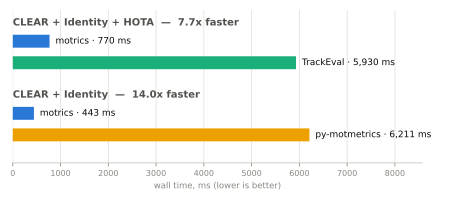

<h1 align="center">motrics</h1>

<p align="center">
  <em>An extremely fast MOT and HOTA metrics library, written in Rust — CLEAR
  (MOTA/MOTP), Identity (IDF1), and HOTA, with an ergonomic Python API.</em>
</p>

<p align="center">
  <a href="https://github.com/kevinconka/motrics/actions/workflows/ci.yml"></a>
  <a href="https://codecov.io/gh/kevinconka/motrics"></a>
  <a href="https://pypi.org/project/motrics/"></a>
  <a href="LICENSE"></a>
  <a href="pyproject.toml"></a>
  <a href="https://github.com/astral-sh/ruff"></a>
</p>

<p align="center">
  <picture>
    <source media="(prefers-color-scheme: dark)" srcset="benchmarks/assets/speedup-dark.svg">
    <source media="(prefers-color-scheme: light)" srcset="benchmarks/assets/speedup-light.svg">
    
  </picture>
</p>
<p align="center"><i>MOT17-train, wall time, from a live CI run — see <a href="#benchmarks">Benchmarks</a>.</i></p>

## Highlights

- ⚡ **Extremely fast** — Rust core, ~7–9× faster than TrackEval and ~12–16×
  faster than py-motmetrics on real MOT17 data.
- 🎯 **Numerically validated** — exact parity with TrackEval on CLEAR,
  Identity, and HOTA, checked in CI.
- 🔄 **Drop-in migration** — swap one import to replace py-motmetrics; evaluate
  a MOTChallenge benchmark without installing TrackEval.
- 🐍 **Ergonomic, typed Python API** — PEP 561, `numpy` the only required
  runtime dependency.
- 🔢 **Flexible box input** — `xyxy` or `xywh`, and a zero-copy read path for
  contiguous NumPy arrays.

## Install

```bash
pip install motrics
```

Prebuilt wheels for Linux, macOS, and Windows (Python 3.10+). Building from
source instead? See [CONTRIBUTING.md](CONTRIBUTING.md) for the dev setup.

## Quickstart

```python
import motrics

# Parse MOTChallenge ground truth and tracker results.
gt = motrics.load_motchallenge("seq/gt/gt.txt")
pred = motrics.load_motchallenge("seq/res.txt", min_confidence=0.5)

# Align onto a shared frame timeline, bundle each side, then evaluate.
gt_ids, gt_boxes, pred_ids, pred_boxes = motrics.align_frames(gt, pred)
result = motrics.evaluate(
    motrics.Frames(ids=gt_ids, boxes=gt_boxes),
    motrics.Frames(ids=pred_ids, boxes=pred_boxes),
)

print(result.clear.mota, result.identity.idf1, result.hota.hota)
```

- Only need one metric? `compute_clear`/`compute_identity`/`compute_hota` take
  the same four arguments directly, no `Frames` needed.
- Boxes: `xyxy` by default, `box_format="xywh"` for the alternative; NumPy
  `(N, 4)` arrays accepted too.
- Want TrackEval's exact reported numbers? Use `load_motchallenge_gt` +
  `preprocess_motchallenge` instead of `load_motchallenge` + `align_frames`.

## Migrating from py-motmetrics or TrackEval

Swap one import — the rest of your code is unchanged.

<details>
<summary>py-motmetrics</summary>

```python
# before
import motmetrics as mm

# after — same code, motrics underneath
import motrics.compat.motmetrics as mm

acc = mm.MOTAccumulator(auto_id=True)
for gt_ids, gt_boxes, pred_ids, pred_boxes in sequence:
    dists = mm.distances.iou_matrix(gt_boxes, pred_boxes, max_iou=0.5)
    acc.update(gt_ids, pred_ids, dists)

summary = mm.metrics.create().compute(acc, metrics=mm.metrics.SUPPORTED, name="acc")
```

`pip install motrics[compat]` (pulls in pandas, needed only for this subpackage).

| | |
| --- | --- |
| ✅ Supported | `mota`, `motp`, `idf1`, `idp`, `idr`, `recall`, `precision`, `num_false_positives`, `num_misses`, `num_switches`, `num_unique_objects` |
| ❌ Not yet | Per-trajectory metrics (mostly-tracked, fragmentations, transfer/ascend/migrate) — raises `NotImplementedError` naming what's missing |

See [`python/motrics/compat/motmetrics/`](python/motrics/compat/motmetrics/)
for what else differs (e.g. no `events`/`mot_events` DataFrame).

</details>

<details>
<summary>TrackEval</summary>

```python
# before
import trackeval

# after — same code, motrics underneath
import motrics.compat.trackeval as trackeval

eval_config = trackeval.Evaluator.get_default_eval_config()
evaluator = trackeval.Evaluator(eval_config)

dataset_config = trackeval.datasets.MotChallenge2DBox.get_default_dataset_config()
dataset_config["GT_FOLDER"] = "data/gt/mot_challenge/"
dataset_config["TRACKERS_FOLDER"] = "data/trackers/mot_challenge/"
dataset_list = [trackeval.datasets.MotChallenge2DBox(dataset_config)]

metrics_list = [trackeval.metrics.HOTA(), trackeval.metrics.CLEAR(), trackeval.metrics.Identity()]

results, messages = evaluator.evaluate(dataset_list, metrics_list)
print(results["MotChallenge2DBox"]["my_tracker"]["COMBINED_SEQ"]["pedestrian"]["CLEAR"]["MOTA"])
```

Same class names, config keys, directory/seqmap conventions, and result shape
as real TrackEval — no `trackeval`/`scipy` install required, only `numpy` (a
core dependency already).

| | |
| --- | --- |
| ✅ Supported | `HOTA`, `Identity`, `CLEAR`'s `MOTA`/`MOTP` — bit-exact vs real TrackEval |
| ❌ Not yet | Parallel evaluation · `BREAK_ON_ERROR` config · printing/plotting · zipped input · `DO_PREPROC=False` · `MOT15` · extra `CLEAR` fields (`MT`/`PT`/`ML`/`Frag`/etc.) · `IDEucl`/`JAndF`/`TrackMAP`/`VACE` |

See [`python/motrics/compat/trackeval/`](python/motrics/compat/trackeval/)
for the full list of what differs from real TrackEval.

</details>

<details>
<summary>Metric name map — TrackEval / py-motmetrics / motrics' native API</summary>

Using `motrics`' own API directly (faster than the compat layer — no
per-frame Python bookkeeping)? Here's how the field names line up:

| Concept                              | TrackEval                   | py-motmetrics          | `motrics` (native)                         |
| ------------------------------------- | ---------------------------- | ------------------------ | -------------------------------------------- |
| Matched detections (incl. switches)   | `CLR_TP`                    | `num_detections`       | `ClearMetrics.num_matches`                 |
| False positives                       | `CLR_FP`                    | `num_false_positives`  | `ClearMetrics.num_false_positives`         |
| Misses                                | `CLR_FN`                    | `num_misses`           | `ClearMetrics.num_misses`                  |
| Identity switches                     | `IDSW`                      | `num_switches`         | `ClearMetrics.num_switches`                |
| MOTA / MOTP                           | `MOTA` / `MOTP`             | `mota` / `motp`        | `ClearMetrics.mota` / `.motp`              |
| Identity TP / FP / FN                 | `IDTP`/`IDFP`/`IDFN`        | `idtp`/`idfp`/`idfn`   | `IdentityMetrics.idtp`/`.idfp`/`.idfn`     |
| IDF1 / IDP / IDR                      | `IDF1`/`IDP`/`IDR`          | `idf1`/`idp`/`idr`     | `IdentityMetrics.idf1`/`.idp`/`.idr`       |
| HOTA / DetA / AssA / LocA             | `HOTA`/`DetA`/`AssA`/`LocA` | — (not in motmetrics)  | `HotaMetrics.hota`/`.deta`/`.assa`/`.loca` |

</details>

## Benchmarks

On real MOT17 data, release build, end-to-end from raw boxes (chart at the top
of this README):

| motrics vs…   | Metrics                | Speedup |
| ------------- | ----------------------- | ------- |
| TrackEval     | CLEAR + Identity + HOTA | ~7–9×   |
| py-motmetrics | CLEAR + Identity        | ~12–16× |

Numbers are illustrative and machine-dependent — see the CI benchmark comment
on any PR for a live measurement. See
[`benchmarks/README.md`](benchmarks/README.md) for methodology and how to run
it yourself.

<details>
<summary>Roadmap</summary>

- [x] Project scaffolding (build, lint, packaging, CI)
- [x] Published to PyPI (`pip install motrics`), automated tag-and-release on
      every `Cargo.toml` version bump (see `.github/workflows/release-tag.yml`)
- [x] Bounding-box IoU + assignment (Hungarian/greedy) primitives
- [x] CLEAR metrics (MOTA, MOTP, ID switches, FP/FN)
- [x] Identity metrics (IDF1 / IDP / IDR)
- [x] HOTA (DetA, AssA, alpha sweep)
- [x] MOTChallenge ingest + integration tests
- [x] TrackEval numeric parity tests (CLEAR / Identity / HOTA)
- [x] Benchmark & parity infrastructure vs **TrackEval** and **py-motmetrics**,
      on real MOTChallenge data, validated in CI.
  - [x] Zero-copy NumPy input path (see "broaden core inputs" below).
- [ ] Replace TrackEval / py-motmetrics, not just benchmark against them:
  - [x] Precomputed-similarity core inputs (`compute_clear_from_similarity`,
        `compute_identity_from_similarity`) — the piece `compat.motmetrics`
        needed, and the first slice of "broaden core inputs" below.
  - [x] `motrics.compat.motmetrics` — a drop-in `MOTAccumulator` replacement.
  - [x] Migration guide + metric-name map (see above).
  - [x] MOTChallenge ingest with TrackEval-parity preprocessing
        (`load_motchallenge_gt` + `preprocess_motchallenge`: distractor-class
        removal, pedestrian-only, "do not consider" rows dropped) — validated
        against TrackEval's own `get_preprocessed_seq_data`, and now what the
        real-data benchmark uses. The enabling piece for `compat.trackeval`.
  - [x] `motrics.compat.trackeval` — a drop-in for TrackEval's
        `Evaluator`/`datasets.MotChallenge2DBox`/`metrics.{HOTA,CLEAR,Identity}`
        (same class names, config keys, and result shape); see above for
        what's out of scope (parallel eval, full `CLEAR` field set, other
        metrics).
  - [x] Broaden core inputs further — `box_format="xywh"` alongside the
        default `xyxy`, and a zero-copy read path for contiguous `(N, 4)`
        float64 NumPy arrays, on `compute_clear`/`compute_identity`/
        `compute_hota`/`iou_matrix`/`match_boxes`. `numpy` is now the one
        required runtime dependency of the core.
- [x] Ergonomic native API — `Frames` bundles one side's ids/boxes (ground
      truth or predictions) so the common case isn't four parallel lists
      retyped per metric; `evaluate()` takes two `Frames` and returns CLEAR +
      Identity + HOTA together, computing the gt/pred similarity matrix once
      and sharing it across all three (`compute_clear`/`compute_identity`/
      `compute_hota` called separately each build their own). The flat
      `compute_clear`/`compute_identity`/`compute_hota` functions are
      unchanged, for single-metric use.
  - [ ] Streaming accumulator — `update()` per frame, `compute()` at the end,
        the shape both py-motmetrics and torchmetrics use, for online
        evaluation or sequences too large to hold fully in memory. Deferred:
        HOTA's alpha sweep is naturally a whole-sequence batch computation,
        so incrementalizing it correctly is real design work, not a thin
        wrapper around the existing core — worth doing once the
        dataset-adapter layer below has settled `Frames` as the shape
        adapters produce, not before.
- [ ] Pluggable dataset-adapter layer — one metric core, one small adapter per
      benchmark (ingest + preprocessing + similarity), added incrementally:
  - [x] DanceTrack — no adapter code needed. Its `gt.txt`/results format is
        byte-for-byte MOTChallenge's (fixed class=1/consider=1 columns), and
        TrackEval evaluates it via plain `MotChallenge2DBox` with no
        DanceTrack-specific preprocessing branch. `load_motchallenge_gt` +
        `preprocess_motchallenge` already handle it — confirmed by a
        round-trip test against TrackEval's real preprocessing and metrics.
  - [x] KITTI 2D-box — `load_kitti`/`load_kitti_gt` + `preprocess_kitti`
        replicate TrackEval's `Kitti2DBox` preprocessing (per-class
        evaluation, `person`/`van` distractors, occlusion/truncation
        thresholds, min-height and `DontCare`-region filtering for unmatched
        predictions), validated against TrackEval's own
        `get_preprocessed_seq_data`.
  - [x] Mask-IoU similarity kernel (KITTI-MOTS, BDD-MOTS, DAVIS) — `Mask`,
        `mask_iou`/`mask_iou_matrix`/`mask_area`/`mask_decode`/`mask_encode`/
        `mask_merge`/`mask_to_bbox`, a from-scratch Rust port of pycocotools'
        RLE codec, a direct run-based intersection/union sweep (no
        dense-array decode), and the `merge`/`toBbox` primitives TrackEval's
        real KITTI-MOTS/MOTSChallenge/RobMOTS adapters need for ignore-region
        unioning and size-based filtering. Includes the `is_crowd`/IoA
        semantics TrackEval's mask datasets use, spelled `is_crowd`
        consistently on both `mask_iou` and `mask_iou_matrix` (matching this
        library's own naming convention, rather than pycocotools' `iscrowd`).
        Accepts pycocotools' own RLE dicts directly (`{"size":
        [h, w], "counts": ...}`, compressed `str`/`bytes` or already-decoded
        run lengths — no `pycocotools` install required), validated
        byte-for-byte and numerically against a real `pycocotools` build.
        This is the similarity kernel (plus the two extra primitives those
        adapters specifically need) the mask-based dataset adapters below
        build on.
  - [x] KITTI-MOTS — `load_kitti_mots`/`load_kitti_mots_gt` +
        `preprocess_kitti_mots` replicate TrackEval's `KittiMOTS`
        preprocessing (per-class evaluation, gt/prediction matching by mask
        IoU, ignore-region-covered unmatched predictions dropped — no
        distractor classes or occlusion/truncation thresholds here, unlike
        KITTI 2D-box), validated against TrackEval's own
        `get_preprocessed_seq_data`. Since there's no core `compute_*` mask
        overload, preprocessing returns ids plus a precomputed similarity
        matrix for the `compute_*_from_similarity` functions. Also adds
        `match_masks`, a mask-IoU sibling to `match_boxes` sharing the same
        Hungarian/greedy assignment core.
  - [ ] BDD-MOTS / DAVIS — same mask kernel, different dataset-specific
        preprocessing rules.
  - [ ] 3D similarity kernel (KITTI-3D) — same as above, separate core work.

</details>

## Contributing

See [CONTRIBUTING.md](CONTRIBUTING.md) for the development setup, tooling,
and checks to run before opening a PR.

## License

[MIT](LICENSE) © 2026 Kevin Serrano
